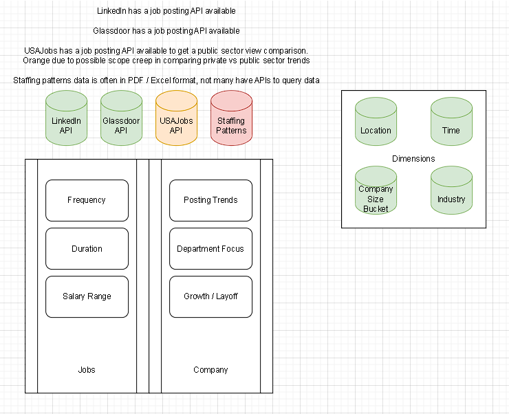

# Batch Pipeline for Company Job Posting History and Dashboard Analysis of Job Trends

## Objective: 
The goal of this project is to track and visualize companies' historical job postings to analyze company growth as well as potential trends in recruitment cycles.

## Motivation: 
Job postings that are available on LinkedIn only represent a snapshot of current openings, my goal is to track how long a single job posting has been up as well as when it was closed to determine the health of a company's job posting frequency and fulfillment. This will give job seekers a more indepth glimpse into the recruitment cycles of companies.

## Use Cases and Insights

This project aims to answer the following questions for potential job seekers

### Question
**How often has this job posting been posted?** 

By tracking a job posting's ID, users will be able to see how often a specific job listing has been posted on the company's LinkedIn.

Potential Metrics
* Average Days to Fulfillment: Measures the average number of days a job posting has been up.
* Concurrent Postings: Measures the number of concurrent postings for the same job position
* Reposting Frequency: Measures the number of times a job posting has been made subsequently

## Conceptual Data Model

## Implementation (Initial & Future)
1. Data Ingestion - To collect and integrate data from various job posting sources
2. Data Cleaning and Modeling - To transform and optimize data into dimensional and fact tables using a star schema.
3. Analytics and Insights - To derive insights from the job posting data to enable insights for job seekers looking into the health of a company through their external recruitment cycles.

